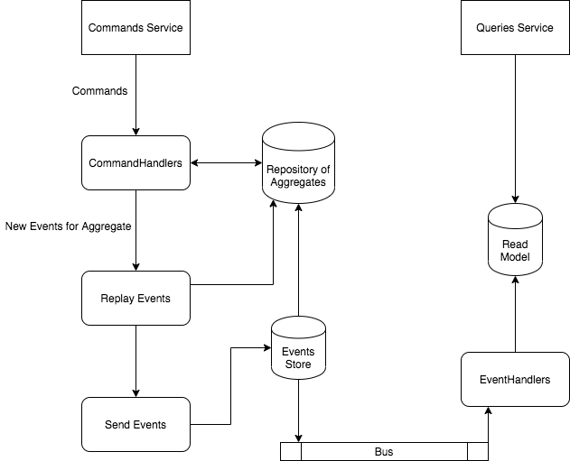

# Purpose of the library

This library fill the lack of small part of CQRS pattern in Go using kafka.  
What it's means? Which part of the CQRS pattern is supported?

**Basic CQRS with Event Sourcing** looks like:  


adding kafka to this diagram then should looks like below:  


As you can see, kafka is responsible for either store events and send them via bus.

The purpose of this library is to simplify restore an repository aggregates state from kafka stream on startup of command (writer) service.  
New events are put on the kafka stream of course and send to the reader service.  

# Structure
The library consists of few elements

## Repository
```go
type Repository interface {
	InitProvider(provider Provider, child Repository) error
	AddOrModifyEntity(entity Entity)
	GetEntity(id string) (Entity, error)
	Replay(events []Event) error
	GetUncommitedChanges() []Event
	Save(events []Event) error
}
```

* **InitProvider** - should be call on startup of the service. Here work the whole magic with restore repository. All events from kafka topic (from all partitions) are restore and aggregate here.
    > Important! One argument of function is `child Repository`. Here should be pass current inherited instance of repository (not base MemoryRepository)
    ```go
    provider := cerk.NewKafkaProvider("example-topic", "example-app-group", "192.168.1.151:9092")
	repository := new(examplerepository.UsersRepository)
	repository.MemoryRepository = cerk.NewMemoryRepository()
	if err := repository.InitProvider(provider, repository); err != nil {
		panic(err)
	}
    ```
* **AddOrModifyEntity** - create new entity (aggregator) or update old by id
* **GetEntity** - get entity (aggregator) by id
* **Replay** - restore/update state of entity/entities 
* **GetUncommitedChanges** - return the new events after update state of entity
* **Save** - just send new events to store/bus

The library has prepared memory implementation of this interface - **MemoryRepository**. This implementation should be inherited by your true Repository [Check example](examples/simple-cqrs-writer/repository/repository.go)

## Provider
```go
type Provider interface {
	FetchAllEvents(batch int) (<-chan []Event, error)
	SendEvents(events []Event) error
}
```

It's a simple interface which provide functions for receive all events (in batches) and send events to bus.

The library give you **KafkaProvider** implementation with simple constructor `NewKafkaProvider(topic string, groupName string, servers string)`

## Event
```go
type Event interface {
	GetType() string
	GetAggregatorId() string
	GetCreateTime() time.Time
	GetVersion() int32
	GetPayload() string

	LoadPayload() error
	SavePayload() error
	InitBy(event Event)
}
```

Abstraction for an event which keep of changed entity state.
* **GetType** - get name of event type
* **GetAggregatorId** - get id of entity
* **GetCreateTime** - when was created
* **GetVersion** - number of current state of entity
* **GetPayload** - return raw payload message
* **LoadPayload** - load payload, convert json to fields of event
* **SavePayload** - save values of fields of event to json string
* **InitBy** - copy data from other event to current

Library provide **GenericEvent** which is use to restore events from topic. Next these events are mapped to true events by `InitBy` function:
```go
func (r *UsersRepository) Replay(events []cerk.Event) error {
	for _, e := range events {
		e.LoadPayload() // GenericEvent
		switch e.GetType() {
		case "UserCreatedEvent":
			event := new(exampleevents.UserCreatedEvent)
			event.InitBy(e) // GenericEvent -> UserCreatedEvent
			event.LoadPayload()
```

Example implementation of event [UserCreatedEvent](examples/simple-cqrs-writer/events/user_created_event.go)

## Entity
```go
type Entity interface {
	GetId() string
}
```

Represents an aggregator in repository. [Example](examples/simple-cqrs-writer/repository/user.go)

# How to start

Best place to start is an example **simple-cqrs-writer**.  
main.go creates an http server which receive json commands:
```json
POST http://localhost:4000
content-type: application/json

{
    "type": "CreateUserCommand",
    "first_name": "Aaaa",
    "last_name": "Bbbbb"
}
```    

```json
POST http://localhost:4000
content-type: application/json

{
    "type": "UpdateUserCommand",
    "id": "<id of entity>",
    "first_name": "Bbbbb",
    "last_name": "Aaaa"
}
```

And then processes them - creates entity or update entity, create events and send them to the kafka stream.

Before start you should set proper kafka server to provider in `main.go`:
```go
    provider := cerk.NewKafkaProvider("example-topic", "example-app-group", "<server>)
```

Start:  
in directory examples/simple-cqrs-writer run:  
`go run .` 